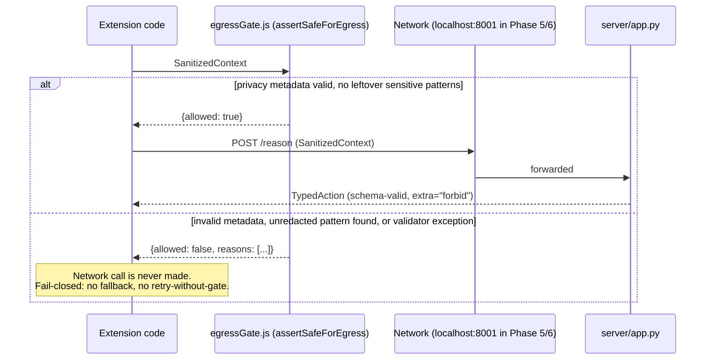
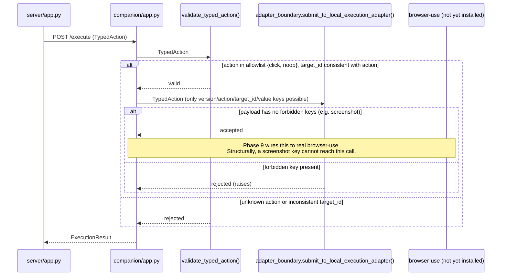
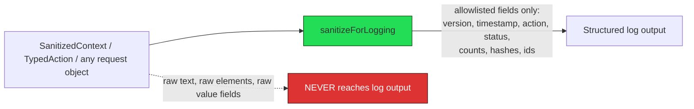

# Privacy Data Flow

## Status: IMPLEMENTED (the gate + schema) / TESTED (12+ deterministic cases) — the upstream stages (local detection, redaction) are UNVERIFIED/OUT OF SCOPE, deferred to Phase 7/8.

## The required path (target architecture, per user instruction)

```mermaid
flowchart LR
    A[Raw screenshot / DOM] -->|OUT OF SCOPE Phase 7/8| B[LOCAL detection]
    B -->|OUT OF SCOPE Phase 7/8| C[LOCAL redaction]
    C --> D[Privacy validation]
    D -->|assertSafeForEgress\nIMPLEMENTED, TESTED| E[Sanitized representation]
    E --> F[Server reasoning\nSTUB — deterministic, no LLM]
    F --> G[Validated typed action\nvalidateTypedAction\nIMPLEMENTED, TESTED]
    G --> H[Local execution\nadapter_boundary\nIMPLEMENTED, TESTED]

    style A fill:#888,stroke:#333
    style B fill:#888,stroke:#333
    style C fill:#888,stroke:#333
    style D fill:#2d5,stroke:#141
    style G fill:#2d5,stroke:#141
    style H fill:#2d5,stroke:#141
```

**What Phase 6 actually built**: the boxes downstream of "LOCAL
redaction" — the contract, the gate that enforces it, and the adapter
boundary on the execution side. Detection and redaction themselves are
explicitly out of scope (Phase 7). This is deliberate: Phase 6 makes it
architecturally impossible for a future implementer to casually wire
`screenshot → server`, *before* the components that would generate a
real screenshot payload exist. The gate has no real detector to call
yet, so it currently only catches the deterministic pattern classes
described in `privacy-contract.md` — this is stated as a limitation, not
hidden.

## Egress leg: extension → server

## Execution leg: server → companion → (future) browser-use

## Logging leg

`sanitizeForLogging()` is an explicit allowlist, not a denylist — a new
field added to `SanitizedContext`/`TypedAction` in a future phase is
**excluded from logs by default** until someone deliberately adds it to
the allowlist. This is the opposite failure mode from the egress gate
(which fails closed on suspicion) by design: logging fails closed by
*omission*, egress fails closed by *rejection* — both bias toward less
data leaving the trusted boundary, not more.

## What remains unimplemented (stated plainly)

- Real local detection (DOM/vision-based PII, password, face detection)
  — Phase 7/8. The gate's pattern-matching (see `privacy-contract.md`)
  is a deterministic sanity net, not a substitute.
- Real redaction (masking, blurring, structural abstraction) — Phase 7.
- Server-side re-validation of `SanitizedContext` beyond schema shape
  (see `trust-boundaries.md`, Threat T9 gap) — recommended for Phase 7,
  not built in Phase 6.
- A single enforced HTTP client wrapper that makes it structurally
  impossible to call the server without going through
  `assertSafeForEgress()` first (currently the gate is available and
  tested, but nothing in the codebase yet *forces* every future caller
  to use it — that enforcement point should be added when the extension
  gains a real network-calling module beyond the Phase 5 stub).

