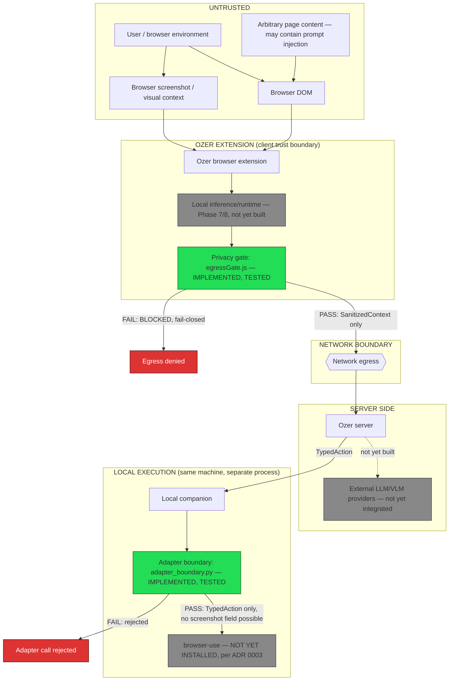

# Trust Boundaries

## Status: IMPLEMENTED (structural boundaries) / TESTED (egress + adapter gates) — UNVERIFIED (real detection accuracy, deferred to Phase 7)

Every claim below is scoped to what Phase 6 actually built and tested —
see [`privacy-contract.md`](../specs/privacy-contract.md) and
[`phase6-threat-model.md`](../specs/phase6-threat-model.md) for evidence.
This document does not claim "secure" or "private" anywhere — see the
Evidence Standard section of the threat model for why.

## Diagram

## Component-by-component model

### 1. User / browser environment
- **Trusted data:** none by default — this is where the human is, but
  the environment itself (other tabs, extensions, malware) is untrusted.
- **Untrusted data:** everything originating here.
- **Sensitive exposure:** highest — this is the source of all sensitive
  data in the system.
- **Permitted inputs:** N/A (source, not a processing component).
- **Permitted outputs:** DOM state, screenshots, user actions.
- **Raw visual data may enter downstream components?** Yes, into the
  extension only — never past the privacy gate.
- **Raw PII may enter downstream components?** Yes, into the extension
  only — never past the privacy gate.
- **Network access:** N/A.

### 2. Ozer browser extension
- **Trusted data:** its own code (assuming the extension itself isn't
  compromised — out of scope for Phase 6, that's a supply-chain
  concern).
- **Untrusted data:** everything from the DOM/screenshot/page content —
  including the page content itself, which may contain adversarial text
  (see Threat T7, prompt injection).
- **Sensitive exposure:** highest of any *processing* component — it's
  the only place raw sensitive data legitimately exists.
- **Permitted inputs:** raw DOM, raw screenshots, user interaction
  events.
- **Permitted outputs:** only what passes through the privacy gate.
- **Raw visual data may enter?** Yes (that's its job — it's upstream of
  the gate).
- **Raw PII may enter?** Yes, same reason.
- **Network access:** only via the privacy gate's approved output path
  — enforced by `assertSafeForEgress()`, IMPLEMENTED and TESTED (see
  `privacy-contract.md`). Not enforced by browser platform mechanisms in
  Phase 6 (e.g. no CSP/manifest-level network lockdown yet) — that is a
  real, stated gap, not silently assumed solved.

### 3. Local inference/runtime (Phase 7/8, not yet built)
- Not yet implemented. Modeled here only so the trust boundary exists
  before the component does — its permitted inputs/outputs are
  documented in `privacy-data-flow.md` as the contract Phase 7 must
  satisfy, not as a currently-enforced boundary.

### 4. Privacy gate (`egressGate.js`)
- **Trusted data:** none — it trusts nothing handed to it and
  independently re-validates (see Threat T4/T5 mitigations).
- **Untrusted data:** the `SanitizedContext` object it receives, even
  though upstream code claims it's already sanitized.
- **Sensitive exposure:** it *sees* potentially-sensitive data (that's
  how it can catch T5 — claimed-but-not-actually-redacted values) but
  its entire purpose is to never let that data leave this function call.
- **Permitted inputs:** a `SanitizedContext`-shaped object.
- **Permitted outputs:** a pass/fail verdict with reasons — never the
  data itself.
- **Raw visual data may enter?** No — the contract schema has no field
  for raw images/screenshots at all (`additionalProperties: false`).
- **Raw PII may enter as a candidate to check?** Yes, structurally
  possible (an attacker/bug could put a raw password in an element's
  `text` field) — the gate's job is to catch this, IMPLEMENTED and
  TESTED for the deterministic pattern classes in scope (see threat
  model T1–T5).
- **Network access:** none — pure function, no I/O.

### 5. Browser DOM
- **Trusted data:** none — arbitrary, attacker-influenceable (T7, T8).
- **Untrusted data:** all of it.
- **Sensitive exposure:** may contain PII, credentials, hidden elements.
- **Permitted inputs/outputs:** N/A (a data source, not a processor).
- **Raw visual/PII data may enter downstream?** Only into the extension,
  same as component 1.
- **Network access:** N/A.

### 6. Browser screenshot / visual context
- Same profile as DOM — untrusted, may contain anything visible on
  screen including sensitive content. No vision model exists yet
  (Phase 8) to process this; it is explicitly **not** part of any tested
  data path in Phase 6.

### 7. Local companion (`companion/app.py`)
- **Trusted data:** the `TypedAction` it receives, but only after
  passing `validate_typed_action()` — IMPLEMENTED and TESTED.
- **Untrusted data:** the raw HTTP request body before validation.
- **Sensitive exposure:** should be **none** by contract — it only ever
  receives `TypedAction` (action/target_id/value), never page content.
- **Permitted inputs:** schema-valid `TypedAction` only, `additional
  properties forbidden` — a `screenshot` field is a schema violation.
- **Permitted outputs:** `ExecutionResult` only.
- **Raw visual data may enter?** No — proven by test (Threat T11/T12,
  `test_adapter_boundary.py`).
- **Raw PII may enter?** Not through the `TypedAction` contract as
  currently scoped (`target_id`/`value` are structural references, not
  free text) — `value` is currently unused by the only implemented
  actions (`click`, `noop`); this remains a design constraint to
  re-verify when action types expand (Phase 8/9), not a permanent
  guarantee.
- **Network access:** none in this phase — receives HTTP, does not make
  outbound calls.

### 8. Ozer server (`server/app.py`)
- **Trusted data:** none — validates every `SanitizedContext` it
  receives against the schema (already enforced via Pydantic +
  `extra="forbid"`) before using it.
- **Untrusted data:** the raw HTTP request body.
- **Sensitive exposure:** should be minimal by contract, since it only
  ever receives what already passed the extension-side gate — but the
  server does **not** currently re-run `assertSafeForEgress()`-equivalent
  logic on ingress; it only does schema validation. This is a **stated
  gap**: defense-in-depth ingress validation is recommended but not yet
  implemented server-side beyond schema shape. See Threat T9 (extension
  bypasses the gate) — the server currently has no independent check
  that would catch this.
- **Permitted inputs:** schema-valid `SanitizedContext`.
- **Permitted outputs:** schema-valid `TypedAction`.
- **Network access:** none in this phase (no real LLM call exists yet —
  `/reason` is a deterministic stub).

### 9. External LLM/VLM providers
- Not yet integrated. No code path sends anything to one. Modeled here
  because Phase 8 will add this, and the trust boundary needs to exist
  in the design before the integration does.
- **When integrated, must receive:** `SanitizedContext` only, post-gate.
- **Must never receive:** raw screenshots, raw DOM text, anything that
  failed `assertSafeForEgress()`.

### 10. browser-use
- Per `docs/adr/0003-browser-use-integration-strategy.md`: not yet
  installed. When it is, it sits **behind** the adapter boundary
  (`adapter_boundary.py`), which this phase proves cannot pass a
  screenshot through, structurally — IMPLEMENTED and TESTED (Threat
  T11).
- **Permitted inputs (once integrated):** `TypedAction` only, via the
  adapter.
- **Must never receive:** raw screenshots, raw page content — this is
  the literal claim ADR 0003 made and Phase 6 is the first place it's
  actually enforced in code, not just documented.

### 11. Network boundary
- The single point everything above either does or doesn't cross.
  `assertSafeForEgress()` is the only sanctioned gate on the
  extension-to-server leg; there is currently no code-level enforcement
  preventing a *different*, not-yet-written code path from calling
  `fetch()` directly without going through the gate — this is a stated
  architectural gap for Phase 7+ to close (e.g. via a single wrapped
  HTTP client that always calls the gate first), not something Phase 6
  claims to have solved.
